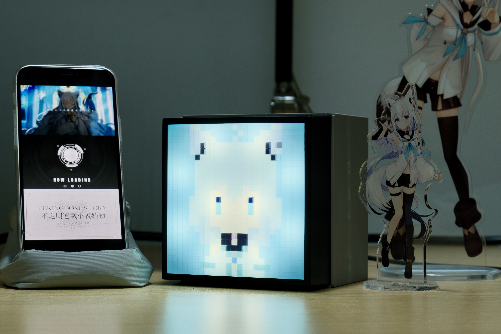

# Hololive-ONAIR-Lamp

This project transforms the official Hololive desk light into a real-time "ON AIR" notification lamp. It automatically plays a startup tune and lights up when your favorite Hololive member begins a YouTube stream.

The project leverages a hybrid approach using both the **Holodex API** and the **YouTube Data API v3** for efficient and rapid stream detection. It uses the Holodex API to discover upcoming streams and then switches to polling the YouTube Data API to pinpoint the exact moment a stream goes live. This method provides near real-time notifications while conserving YouTube's more expensive API quota.

Great thanks to the **Holodex Team** for their fantastic service and API! You can learn more about them on their [GitHub](https://github.com/HolodexNet/Holodex).

## Features

- **Hybrid Stream Detection**: Utilizes Holodex API for efficient discovery of upcoming streams and YouTube Data API for high-frequency polling to detect when a stream goes live. This saves API quota and provides faster notifications.
- **ON AIR Notification**: When a stream starts, the lamp plays a customizable startup sound and then remains lit.
- **Customizable Audio**: The notification sound can be easily changed by converting a simple MIDI file.

## Hardware

This project is designed to run on an **ESP32-S2** microcontroller. A custom PCB is designed to fit perfectly inside the official Hololive desk light merchandise.

- **Microcontroller**: An ESP32-S2 based board.
- **Custom PCB**: Schematic files (`desklight_board.pdf`) and Gerber/Pick&Place files for manufacturing (`jlcpcb.zip`) can be found in the [`resource/`](./resource/) directory.
- **Official Hololive Desklight**: This project is intended to modify the official merchandise.
- **3D Printed Case & bolts/nuts** are required.

## Software Setup

The firmware is written in MicroPython.

### 1. API Key Preparation

Before setting up the device, you need to acquire two API keys:

**A. Holodex API Key**
1. Register for an account on the [Holodex.net](https://holodex.net/) website.
2. Log in and navigate to your account settings page.
3. Generate your API key from the developer settings section.

**B. YouTube Data API Key**
1. Go to the [Google Cloud Console](https://console.cloud.google.com/).
2. Create a new project (or select an existing one).
3. In the navigation menu, go to **APIs & Services > Library**.
4. Search for "**YouTube Data API v3**" and enable it for your project.
5. Go to **APIs & Services > Credentials**.
6. Click "**Create Credentials**" and select "**API key**".
7. Copy the generated API key. It is recommended to restrict the key to only be used for the YouTube Data API v3 to enhance security.

### 2. Configuration

Create a `config.json` file inside the `src` directory. You can copy and rename the `config.json.example` template.

```json
{
    "ssid": "YOUR_WIFI_SSID",
    "password": "YOUR_WIFI_PASSWORD",
    "key_holodex": "YOUR_HOLODEX_API_KEY",
    "enable_youtube_api": true,
    "key_youtube": "YOUR_YOUTUBE_DATA_API_KEY",
    "channelId": "YOUTUBE_CHANNEL_ID_TO_MONITOR"
}
```

- `ssid` & `password`: Your Wi-Fi network credentials.
- `key_holodex`: Your personal API key for the Holodex API.
- `enable_youtube_api`: Set to `true` to use the rapid polling feature with the YouTube API, or `false` to rely solely on the Holodex API.
- `key_youtube`: Your API key for the YouTube Data API v3. If enable_youtube_api is `false`, doesn't matter if you empty this field.
- `channelId`: The ID of the Hololive member's YouTube channel you want to monitor (e.g., `UCdn5BQ06XqgXoAxIhbqw5Rg` for Fubuki Ch.).

### 3. Notification Sound

The lamp plays a notification sound from an `audio.bin` file. A tool is provided to convert a simple MIDI file into this format.

- Place your MIDI file (e.g., `sound.mid`) in the `tool` directory.
- Run the converter: `python midi_converter.py ./sound.mid`
- This will generate the `audio.bin` file, which should be placed in the `src` directory.

### 4. Flashing the Firmware

- Flash your ESP32-S2 board with a recent version of MicroPython.
- Upload all the files from the `src` directory (including `main.py`, `fsm.py`, `spwm.py`, `boot.py`, `config.json`, and `audio.bin`) to the root of the microcontroller's filesystem.
- The `mpy_tool.py` script in the `tool` directory can help automate the file upload process.

## [Tools](./tool/README.md)

The [`tool/`](./tool/) directory contains helpful scripts for development:
- `midi_converter.py`: Converts MIDI files to the `audio.bin` format.
- `mpy_tool.py`: A utility for interacting with a MicroPython board.
- `requirements.txt`: Python dependencies required for the tools.